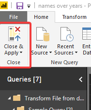
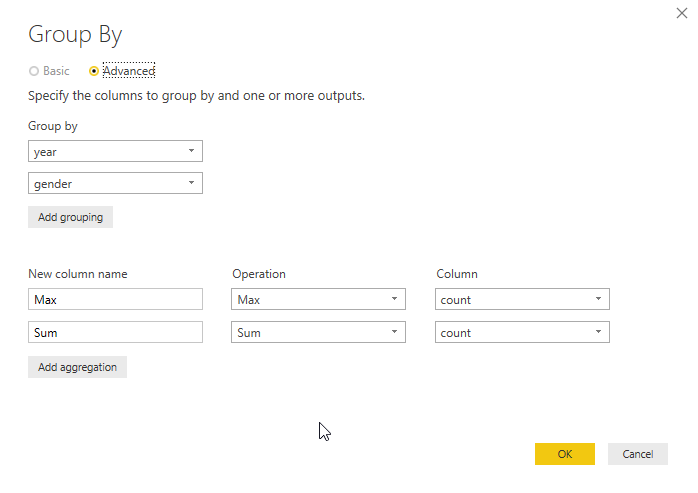
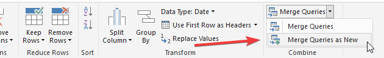

# Power BI Walkthrough

#### This walkthrough expects basic knowledge of Power BI or Power Query. If you are unclear how certain steps are performed reference my [Power Query Intro](https://github.com/click-here/Pandas-vs-Power-Query/blob/master/Part1/Excel.md) repo.

1. Select `Get data` when Power BI opens.
	
	

2. Load data from folder and rename columns, extract text range, and change types as shown.

	
	
3. Then name this query, I chose "all names", and select "Close & Apply". We are done with this query for now.

	
	
4. On the `Home` tab you will see an `Edit Queries` button. This is how you get back to your queries. Click this and then duplicate the query we just made via right clicking on it.

	

5. Using the duplicated query we will continue adding steps. On the `Transform` tab select `Group By` and perform an advanced grouping like shown below. Be sure to rename this copy so as to not get confused.

	

6. We could divide our columns as shown in the intro tutorial but instead we're going to to use the `percent of` math function.  Be sure to select the columns in the correct order to get the correct percentage!

	
	
7. When we grouped by `year` and `gender` you may have noticed we lost our names. We wanted to keep the top name but you cannot do that with a grouping function.  We can now merge this query with the first one we made to get our names back!  Without leaving the current query go to the `Home` tab and select the `Merge Queries` dropdown and select `Merge Queries as New`

	

8. The first dropdown should show your most recent query. The second query must be set to the first query we made.  (I called it `all names`) Now we need to join these 2 queries on **three** columns. The name of the columns is not important as you can see we have different column names that we are telling Power BI to merge. What is important is that we select related columns. We want our merge to occur when `year` equals `year` as opposed to `year` equals `gender`. We are 'comparing' and merging identically numbered columns. (numbered via ctrl selection)  Notice the little numbers at the top of the columns? We will use a Left Outer Join. If you want to learn more about joins you can check out [this](http://www.khankennels.com/blog/index.php/archives/2007/04/20/getting-joins/) post.

	
	
	
	
9. Once this loads we are now viewing our third query. Let's expand our new column in our new query and bring in those most popular names! Remember, we are only bringing in one name be cause we joined on `count`/`max` so we only get the name with that count. Close and Apply.

	

10. Select the `Line Chart` visualization. Drag `year` to `Axis`, `gender` to `Legend`, `Percent of` to `Values, and our names field to `Tooltips`.  Make that `Percent of` is not set to count. There's only one of each so you would be left with a vertical bar.  You can select `sum`.

	
	
Viola!  What have we learned? Growing up in the 90's meant there was generally always a Michael or Jessica in your class. Kids born these days will not likely have the same experience but imagine what it was like in the 1800's!

